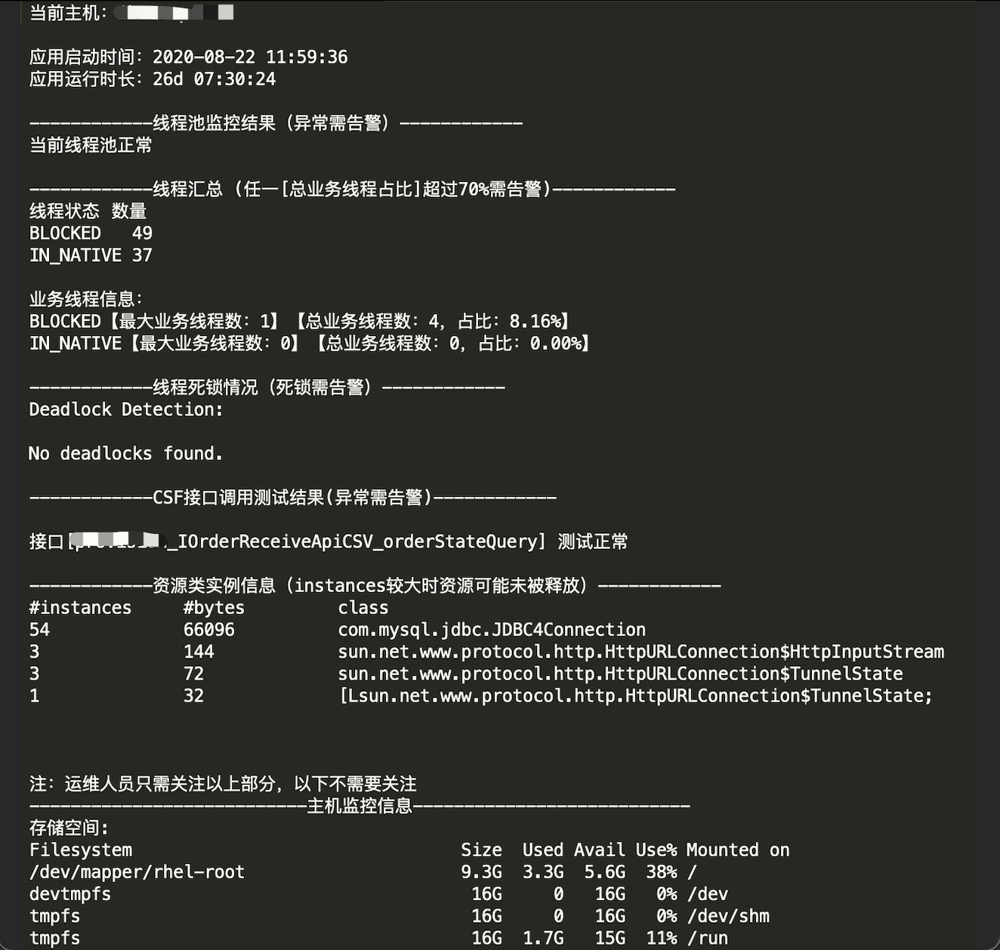
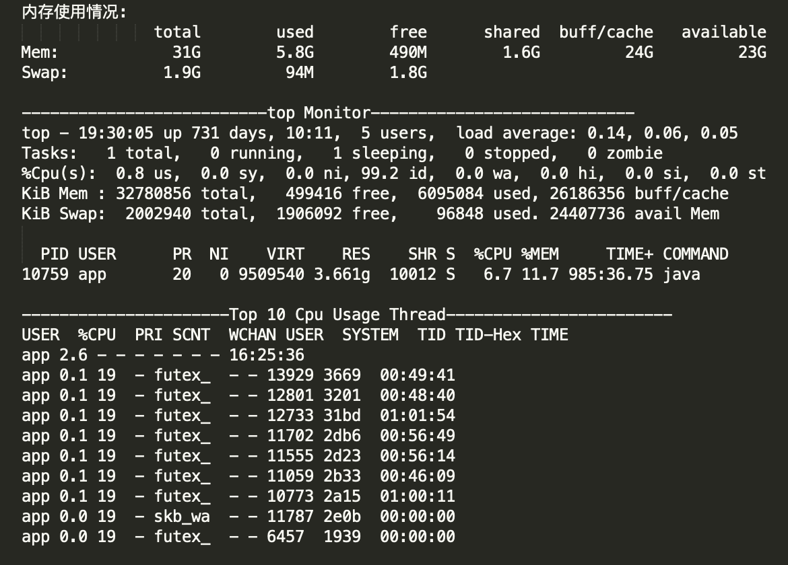

# 基于shell开发的Java服务监控工具

## 1.简介
该工具可以定时监控Java服务运行时的线程Stack、线程池、CPU、JVM等性能指标，当性能指标异常时，系统会预先邮件告警，通知相关维护人员。

## 2.处理流程
### 2.1 参数解析及校验
读取并解析命令行参数和配置文件参数，提供专业的long/short option usage使用说明
### 2.2 进程
根据jmap，jstat等jvm工具导出的数据，过滤、抽取、计算JVM内存关键指标(资源类实例数、前后周期GC时间差、OldGen内存使用情况等)
### 2.3 线程
对线程Stack信息过滤、分组、排序，计算不同状态线程和业务线程的各自占比，并计算CPU消耗TopN线程ID及其对应的线程Stack
### 2.4 线程池
扫描应用程序日志中的线程池信息，计算线程池运行监控指标
### 2.5 服务器性能指标
获取CPU、内存、存储、Tcp连接、打开文件数等信息
### 2.6 智能邮件告警
将计算得到的指标值与配置的阈值对比，当满足邮件发送条件时，把指标信息填充到html邮件模板中并发送邮件，邮件正文中支持异常指标高亮显示

## 3.功能效果
### 3.1 邮件标题&正文 

### 3.2 邮件附件 

### 3.3 附件详情

